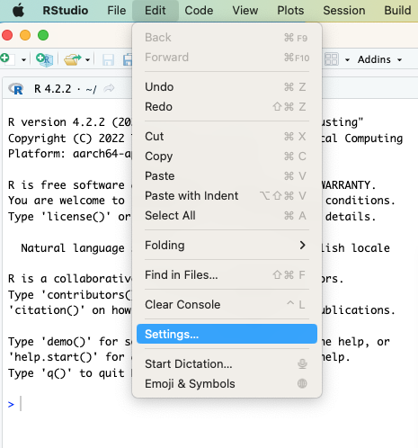
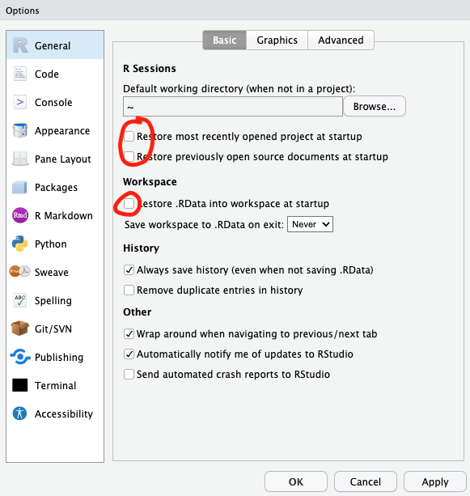
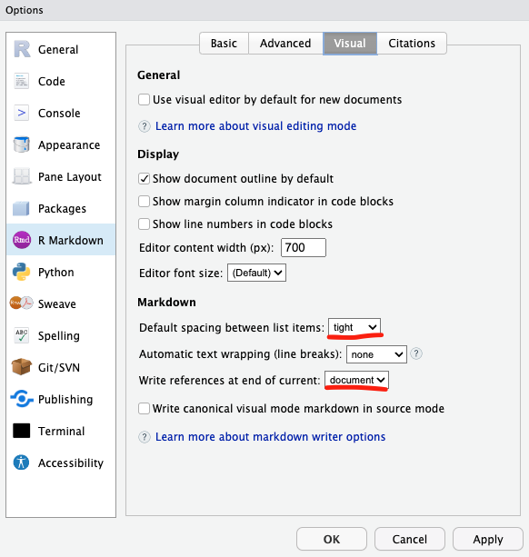
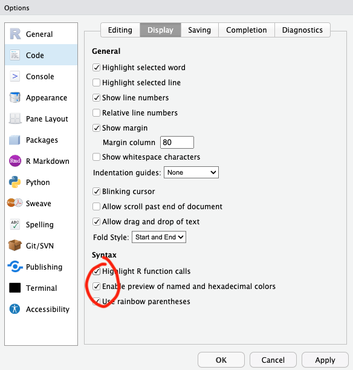

```{r klippy, echo=FALSE, include=TRUE}
klippy::klippy(c('r', 'bash'))
```

# R General Studio Settings

R Studio is an IDE (Integrated development environment) for R. Both R and R Studio can be downloaded from <https://posit.co/download/rstudio-desktop/>

You can find R Setting here:

{width="350"}

Some settings that are not default that I like to change:

-   To avoid loading the workspace and previous session documents by default:

{width="350"}

-   Some Markdown settings:

{width="350"}

-   Some useful syntax highlighting:

{width="350"}

# Setting up Python (Advanced)

Markdown files on RStudio can be used as Project Notebooks even with code in other languages (Python, Perl...).

This installs the devtools version of the reticulate package <https://rstudio.github.io/reticulate/index.html>:

```{r, eval=FALSE}
if (!requireNamespace("devtools", quietly = TRUE))
    install.packages("devtools")
(devtools::install_github("rstudio/reticulate"))
```

In order to use your desired Python environment you need to define the path in the .Rprofile for the project.

```{r, eval=FALSE}
file.edit(".Rprofile")
```

In the opened .Rprofile file paste this: Sys.setenv(RETICULATE_PYTHON = "/opt/miniconda3/bin/python")

You should substitute the path to your own Python environment in your computer. If you don't know the path, open the Terminal, activate your desired Python environment and use `which python` to find the path.

You need to run this chunk of code at the begging of each .Rmd file in your project

```{r, eval=FALSE}
#Sys.getenv("RETICULATE_PYTHON") #This forces R to search in the path we set up in the .Rprofile  
library(reticulate)
use_condaenv("env_name", required = TRUE) 
py_config() #This is to see what python is being used. It should be your desired environment
```

Now you can run in the document several types of code chunks:

-   R code using {r}

```{r}
R.Version()$version.string
```

-   Python code (with your desired Python environment activated) using {bash}

```{bash}
which python
```

This Python code is not interactive, you cannot run commands that require you to interact during their execution. If you want to use Python interactively use this function to start a Python session in the Console:

```{r, eval=FALSE}
repl_python()
```

You can also just run code interactively on the RStudio Terminal.
