# Setting up SSH keys for your device via R Studio

Go to R Studio Settings and in the **Git/SVN** tab, hit *Create RSA Key*. In the window that appears, select ED25519 hit the *Create* button. The RSA file will be stored in a directory *(You can choose your own desired directory too).* Click, *View public key* and copy the displayed public key

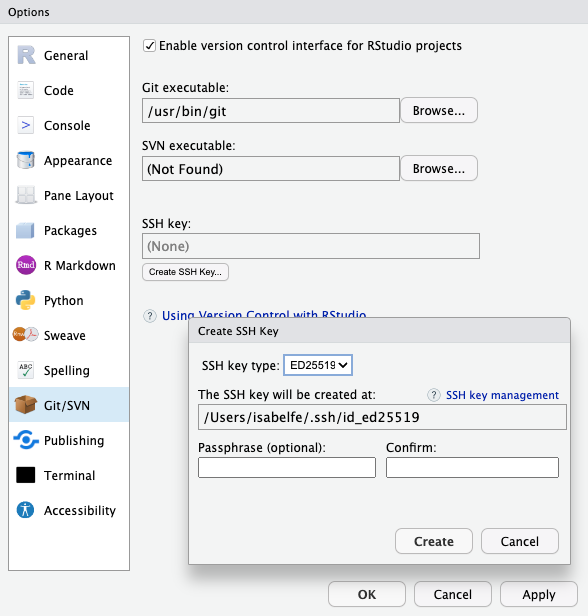{width="350"}

If you haven't already, create a GitHub account. On the GitHub website, open the account settings tab and click the SSH keys tab. Click *Add SSH key* and paste in the public key you have copied from RStudio. You can have several keys (from different devices) linked to your GitHub account, use meaningful titles to identify them.

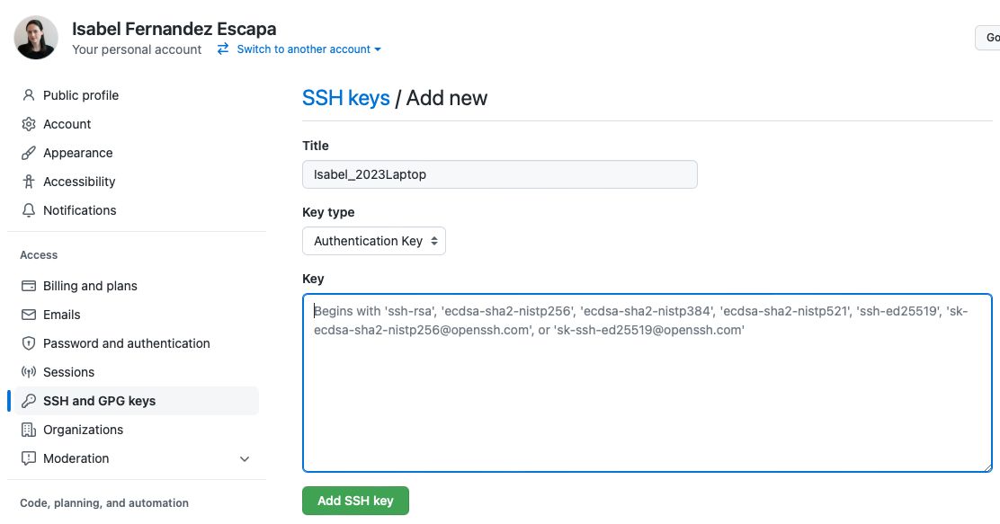{width="600"}

# Creating a new repository in GitHub

You can create a new repo on your own GitHub profile page, click on *Repositories*, then click the green *New* button. Consider creating the new repo from a Team page if this is a Team Project.

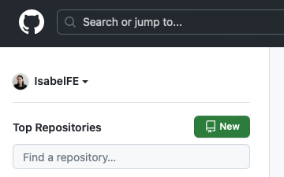{width="279"}

In the next page select a *name* for your repository and a short *description*. You can make your repo public or private.

I recommend adding a `README.md` file to include general information about your project and possible an outline of the documents included.

## Ignoring files in GitHub

Also I recommend adding a `.gitignore` file with *R template*.

{width="600"}

The .gitignore file's purpose is to prevent everyone who collaborates on the same project from accidentally committing some common files in a project, such as generated cache files. This is really **IMPORTANT** if you make edits to the .Rprofile file like editing the path to a Python environment.

You can open the .gitignore file with this code:

```{r, eval=FALSE}
file.edit(".gitignore")
```

I recommend having an "*ignore*"folder in you project where you can keep files you don't want to get sync to the GitHub repo. For example big files that can not be uploaded to GitHub, or temporary files that don't need to me committed. You can have a *GitHubIgnored* folder in some cloud service as backup for all your repos *ignore* folders.

# Cloning a GitHub repository into your computer via R Studio

First, go to the GitHub page for your repo and copy the SSH URL to your clipboard via the green *Code* button.

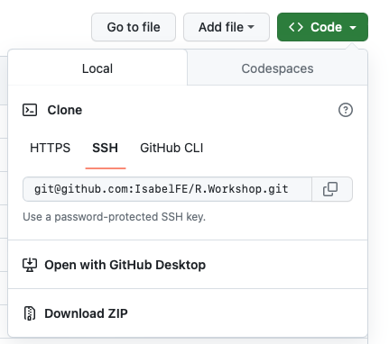{width="350"}

Now go to RStudio and start a new Project: **File \> New Project \> Version Control \> Git**

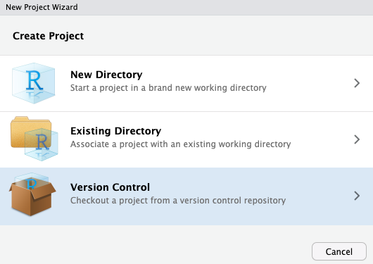{width="350"}

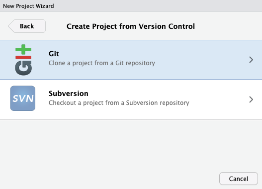{width="350"}

In *Repository URL*, paste the URL of the GitHub repository you already copied into your clipboard. Accept the default project directory name, e.g. R.Workshop, which coincides with the GitHub repo name and pay attention to where you save it!

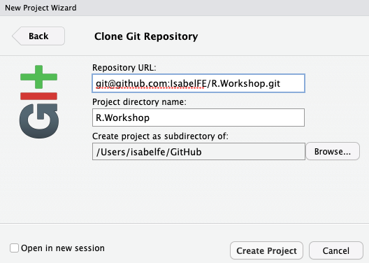{width="350"}

# Working with Git via R Studio

## Working on the Main branch

If you are working in a project by yourself, or in early stages of a project whit different contributors working on independent files, it can be convenient to work directly into the "main" branch. It is really **IMPORTANT** that you always "commit" your changes locally before doing "pull". If someone else has edited the same file, and the changes were "pushed" to **remote** (GitHub), you will lose any **local** updates (your computer) and will not be able to recover them. However, you will not be able to "push" your new commits if there are pending commits that you have not "pulled" first. Therefore, the right order to commit changes to your **local** and **remote** versions of a repository from RStudio are:

### "Commit" your new changes **locally**

-   Look at the *Git* panel on the upper right section of RStudio to see if you have pending files that have been modified **locally**.

    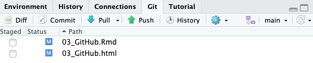

-   Check the "staged" box for the files you want to update, or hit the "commit" button to open the *Git* pop-up section and check "staged" in there.

    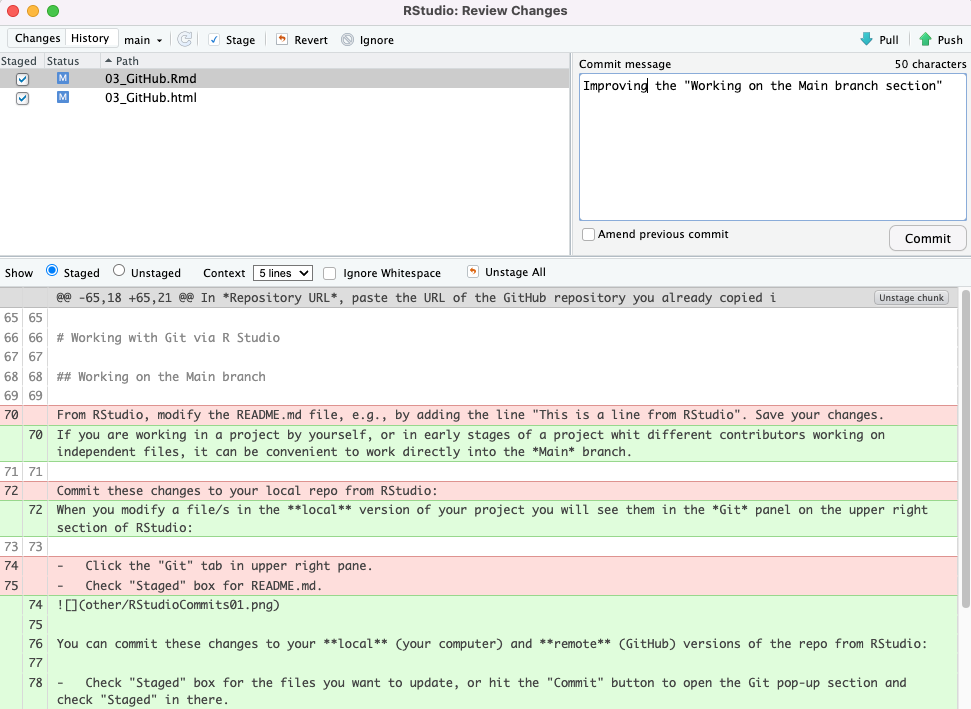

-   If you're not already in the Git pop-up, click "commit".

-   Review the changes and type a message in "commit message".

-   Click "commit". Now your "main" branch is ahead or "origin/main" by 1 commit. The changes have been committed **locally**, but not to **remote**.

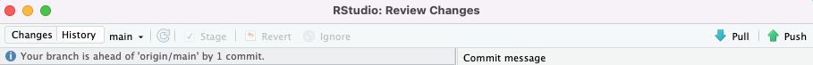{width="663"}

### "Pull" to get other updates from **remote**

-   If there are updates in the **remote** version that need to be updated **locally**, you need to "pull" those changes into the **local** version using the "pull" button in the *Git* panel on the upper right section of RStudio. Don't worry if you forget to do this step, if there are pending commits to be "pulled" you will be prompted to do a "pull". Also, if the newly "pulled" updates conflict with your new commits you will need to fix the issues before moving ahead.

### "Push" your **local** updates into **remote**

-   Click "push" to commit your **local** changes into the **remote** GitHub version. If you go back to your browser you will see the **local** changes have been uploaded to GitHub.

    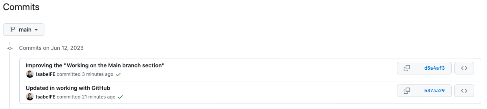

## Working with multiples branches

This is the recommended way of working with *Git.* There are two styles of working with branches as a Team:

1.  Create a new branch for each unit of work and close it after the work gets merged into "main". Many teams use this workflow by linking each branch to each task defined in a project management tool like Jira.
2.  Use a branch for each of the collaborators in a project and keep the branch open after each merge. You need to "pull" the merge back from **remote** into the **local** version of your branch after a "pull request" gets "merged" (see below).

### Creating a new branch

-   You can create a new branch from the *Git* panel on the upper right section of RStudio by clicking on the branch logo to the right of the settings button.

    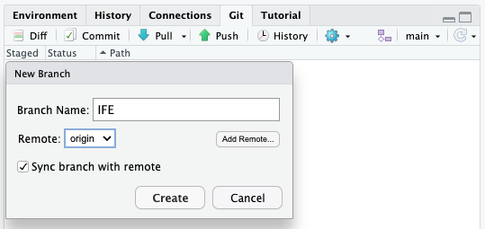

-   You can also use command line in the Terminal or the *Terminal* tab on R Studio:

```         
git branch <branch name> #Creates a new branch
git checkout <branch name> #Switch to a branch
```

### Making commits and basic "pull"/"push"

-   The general process is similar to the one described for working on "main", just make sure the right branch is selected on the upper right corner of the *Git* panel.
-   You can also use command line in the Terminal or the *Terminal* tab on R Studio:

```         
git pull # pulls into the current branch from its remote version
git push # push the changes from the local to the remote version of your branch
git status # show changes/edits made
git commit -a -m "your message" # stage and commit your changes
```

### Merging branches

-   Once you have committed your changes your **local** branch will be ahead or "origin/\<branch name\>" by 1 commit.

    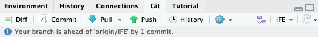

-   After "pushing" to **remote** you can also see in GitHub that the new branch is ahead of main and make a "pull request".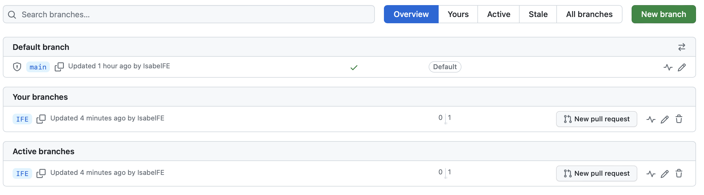

-   Depending on the repository settings a number of reviews by other members of the team will be required before merging. Some members of the team might have privileges to merge without prior review.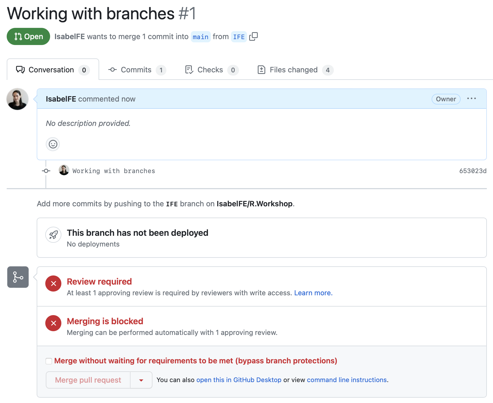

-   After the merge you can chose to close the branch or keep it open (see above about different working styles)

    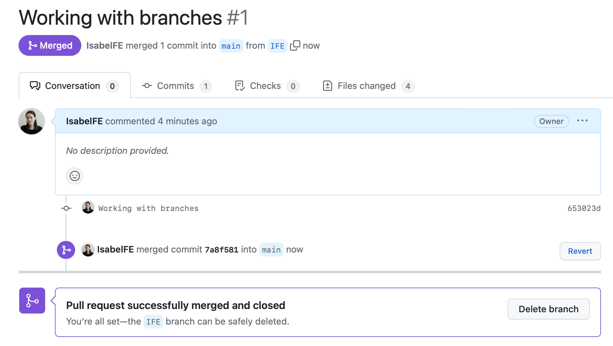

-   After the merge you can open RStudio, make sure you are in the "main" branch, and "pull" in order to bring the merge commit into the **local** version of "main*"*.

-   If you have chossen to keep working in the same personal branch, swich to that and "merge main" into your branch **locally** and after "push" to the **remote** version.

    ```         
    git checkout <branch name>
    git merge origin
    git push
    ```

    Instead of doing all these steps from GitHub you can install the [GitHub CLI](https://cli.github.com/manual/) and use command line:

    ```         
    gh pr create # create a pull request
    gh pr review # show you description and website link of pull request. It does not let you review your own
    gh pr merge # merge the pull request into main once it has been aproved. 
    gh pr merge --admin # If you have admin privileges you can create and merge your own pull request

    git checkout main
    git pull
    git checkout <branch name>
    git merge origin 
    git push
    ```

# Helpful Links

For help with Git/GitHub and R integration see: Helpful

-   <https://happygitwithr.com/index.html>
-   <https://argoshare.is.ed.ac.uk/healthyr_book/create-an-ssh-rsa-key-and-add-to-your-github-account.html>
-   <https://enosjeba.medium.com/connecting-git-with-r-studio-fcbc2b6ee19e>
