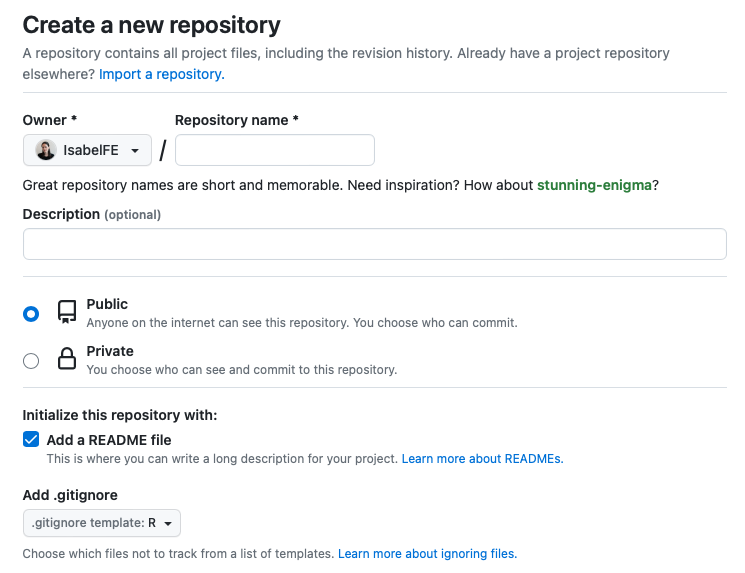

# Setting up SSH keys for your device via R Studio

Go to R Studio Settings and in the **Git/SVN** tab, hit *Create RSA Key*. In the window that appears, select ED25519 hit the *Create* button. The RSA file will be stored in a directory *(You can choose your own desired directory too).* Click, *View public key* and copy the displayed public key

{width="350"}

If you haven't already, create a GitHub account. On the GitHub website, open the account settings tab and click the SSH keys tab. Click *Add SSH key* and paste in the public key you have copied from RStudio. You can have several keys (from different devices) linked to your GitHub account, use meaningful titles to identify them.

{width="600"}

# Creating a new repository in GitHub

You can create a new repo on your own GitHub profile page, click on *Repositories*, then click the green *New* button. Consider creating the new repo from a Team page if this is a Team Project.

{width="279"}

In the next page select a *name* for your repository and a short *description*. You can make your repo public or private.

I recommend adding a `README.md` file to include general information about your project and possible an outline of the documents included.

## Ignoring files in GitHub

Also I recommend adding a `.gitignore` file with *R template*.

{width="600"}

The .gitignore file's purpose is to prevent everyone who collaborates on the same project from accidentally committing some common files in a project, such as generated cache files. This is really **IMPORTANT** if you make edits to the .Rprofile file like editing the path to a Python environment.

You can open the .gitignore file with this code:

```{r, eval=FALSE}
file.edit(".gitignore")
```

I recommend having an "*ignore*"folder in you project where you can keep files you don't want to get sync to the GitHub repo. For example big files that can not be uploaded to GitHub, or temporary files that don't need to me committed. You can have a *GitHubIgnored* folder in some cloud service as backup for all your repos *ignore* folders.

# Cloning a GitHub repository into your computer via R Studio

First, go to the GitHub page for your repo and copy the SSH URL to your clipboard via the green *Code* button.

{width="350"}

Now go to RStudio and start a new Project: **File \> New Project \> Version Control \> Git**

{width="350"}

{width="350"}

In *Repository URL*, paste the URL of the GitHub repository you already copied into your clipboard. Accept the default project directory name, e.g. R.Workshop, which coincides with the GitHub repo name and pay attention to where you save it!

{width="350"}

# Working with Git via R Studio

## Working on the Main branch

From RStudio, modify the README.md file, e.g., by adding the line "This is a line from RStudio". Save your changes.

Commit these changes to your local repo from RStudio:

-   Click the "Git" tab in upper right pane.
-   Check "Staged" box for README.md.
-   If you're not already in the Git pop-up, click "Commit".
-   Type a message in "Commit message", such as "Commit from RStudio".
-   Click "Commit".

Now Push your local changes online to GitHub: click the green "Push" button to send your local changes to GitHub. Go back to the browser and confirm the local change propagated to GitHub.

## Working as a Team with multiples branches

hhhhh

# Helpful Links

For help with Git/GitHub and R integration see: Helpful

-   <https://happygitwithr.com/index.html>
-   <https://argoshare.is.ed.ac.uk/healthyr_book/create-an-ssh-rsa-key-and-add-to-your-github-account.html>
-   <https://enosjeba.medium.com/connecting-git-with-r-studio-fcbc2b6ee19e>
