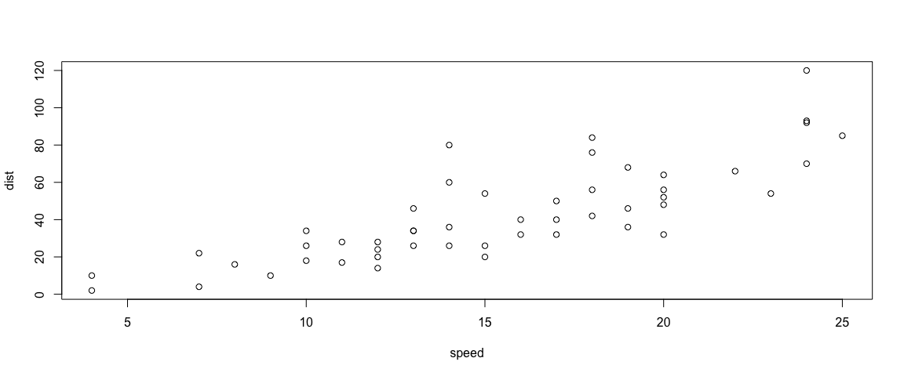

Introduction to R
================
Escapa I.F.
2023-05-24

<br></br> <br></br>

This is an R Markdown document (`file.Rmd`). Markdown is a simple
formatting syntax for authoring HTML, PDF, and MS Word documents.

Try using the *knit* function. All the packages and objects must be
included in the script, knit doesn’t take them from the local
environment.

# Markdown Syntax (This is a primary heading)

This is sample sentence number 1. This is sample sentence number 2.
(Newlines require a double space!)

This is sample sentence number 3.

This is sample sentence number 4.

*This text will appear italicized!*

**This text will appear bold!**

\*literal asterisks\*

    This text is fixed-width font that you can use for code blocks.
    This text is displayed verbatim / preformatted

This text is in-line `fixed-width` font.

~~strikethrough~~

> This is the first level of quoting
>
> > This is nested block-quote

If you need to add extra space between lines use this: <br></br>
<br></br> <br></br> <br></br>

Three or more asterisks or dashes make a Horizontal Rule / Page Break
\*\*\*\*\*

## Lists

- first item in list
- second item in list
- third item in list
- You don’t need to use the same symbol all the time!
  - And you can add levels

1.  First item in list
2.  The same works with numbers (even if you don’t follow the right
    order)
3.  Third item in list
4.  ….

## Links

For more details on using R Markdown see <http://rmarkdown.rstudio.com>.
You can also check [The Official Markdown
Documentation](http://daringfireball.net/projects/markdown/basics)

In general [R Studio](http://www.rstudio.com/ "R Studio") and
[Knirt](http://yihui.name/knitr/ "Knirt") websites are really useful.
(Have you seen the links at the bottom of the script?)

## Images

You can take them from the web:


Or use local files: 

# Chunk options

Make a code chunk with three back ticks followed by an r in braces. End
the chunk with three back ticks:

``` r
mydata <- cars
head(mydata)
```

    ##   speed dist
    ## 1     4    2
    ## 2     4   10
    ## 3     7    4
    ## 4     7   22
    ## 5     8   16
    ## 6     9   10

``` r
plot(mydata)
```

<!-- -->

You can modify the format of the plot using `fig.width =` and
`fig.height =`:

``` r
plot(mydata)
```

<!-- -->

If you want to see the output but not the source code use the
`echo = FALSE` parameter to prevent printing of the R code that
generated the plot.

    ##      speed           dist       
    ##  Min.   : 4.0   Min.   :  2.00  
    ##  1st Qu.:12.0   1st Qu.: 26.00  
    ##  Median :15.0   Median : 36.00  
    ##  Mean   :15.4   Mean   : 42.98  
    ##  3rd Qu.:19.0   3rd Qu.: 56.00  
    ##  Max.   :25.0   Max.   :120.00

You can also do `results = "hide"` and hide the resulting code instead.

``` r
summary(mydata)
```

To include code output into the Markdown text use :

``` r
rand <- rnorm(1)
```

Here you have a random number: 1.2798678.

------------------------------------------------------------------------

For more details on using Knit chunk options go to
<http://yihui.name/knitr/options>
