Introduction to R
================
Escapa I.F.
2023-05-24

<br></br> <br></br>

``` r
library(tidyverse)
library(Hmisc) #For summary functions
library(xtable) #For printing the statistics tables
```

# Data Import and Reshaping

``` r
rawdata <- read.csv("data_input/Example01.csv")
```

The initial data are in **wide** format, we need them in **long
format**. For this transformation we can use `reshape`:

``` r
longdata <- reshape(rawdata, varying =list(c("Bio.1","Bio.2","Bio.3","Bio.4")), v.names = "Biofilm", timevar = "Experiment", direction = "long")
longdata$id <- factor(longdata$id, labels = c("WT_TSB","MutA_TSB","MutB_TSB","MutAB_TSB","WT_CDM","MutA_CDM","MutB_CDM","MutAB_CDM"))
```

# Basic Plots

## Scatterplots

``` r
ggplot(longdata) 
```

<!-- -->

``` r
ggplot(longdata, aes(x = Strain, y = Biofilm)) +
  geom_point()
```

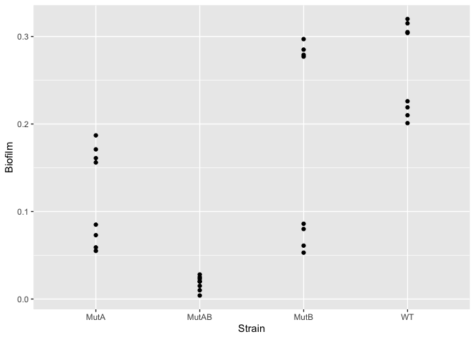<!-- -->

``` r
ggplot(longdata, aes(x = Strain, y = Biofilm, color = Media)) +
  geom_point()
```

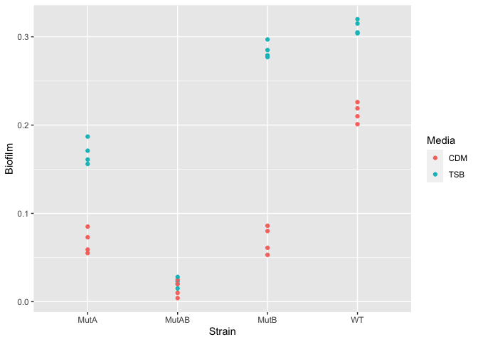<!-- -->

``` r
ggplot(longdata, aes(x = Strain, y = Biofilm, color = Media)) +
  geom_boxplot() 
```

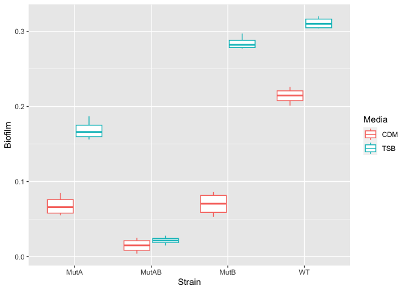<!-- -->

``` r
ggplot(longdata, aes(x = Strain, y = Biofilm, color = Media)) +
  geom_boxplot() +
  geom_point(position = position_dodge(0.75), alpha=0.5)
```

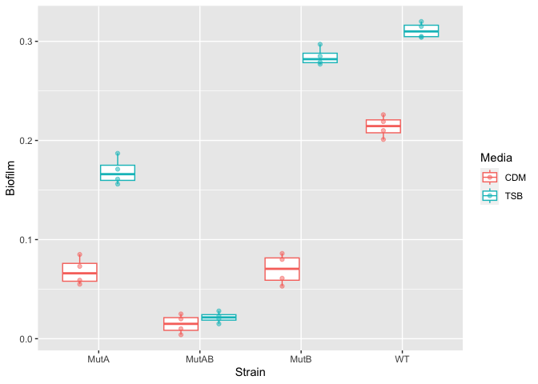<!-- -->

``` r
ggplot(longdata, aes(x = Strain, y = Biofilm, color = Media)) +
  geom_point(alpha=0.5) +
  stat_summary(fun = "mean", geom = "point", size = 4)
```

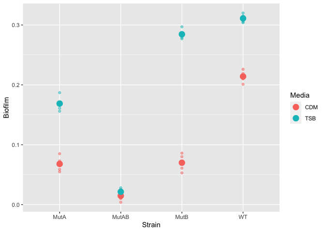<!-- -->

``` r
ggplot(longdata, aes(x = Strain, y = Biofilm, color = Media)) +
  stat_summary(fun = "mean", geom = "point", size = 4)
```

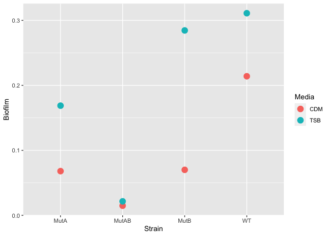<!-- -->

## Bar plots

``` r
ggplot(longdata, aes(x = Strain, y = Biofilm, color = Media)) +
  stat_summary(fun = "mean", geom = "bar")
```

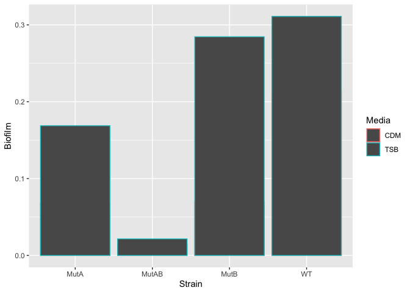<!-- -->

``` r
ggplot(longdata, aes(x = Strain, y = Biofilm, fill = Media)) +
  stat_summary(fun = "mean", geom = "bar", position = position_dodge())
```

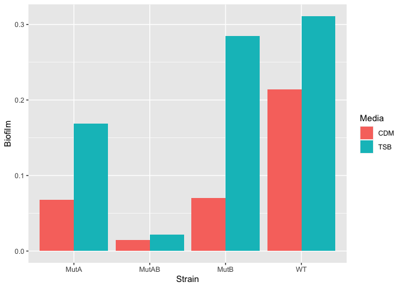<!-- -->

``` r
ggplot(longdata, aes(x = Strain, y = Biofilm, fill = Media)) +
  stat_summary(fun = "mean", geom = "bar", position = position_dodge()) +
  stat_summary(fun.data = "median_hilow", geom = "errorbar", position=position_dodge(.9)) 
```

<!-- -->

``` r
ggplot(longdata, aes(x = Strain, y = Biofilm, fill = Media)) +
  stat_summary(fun.data = "median_hilow", geom = "errorbar", position=position_dodge(.9), width = 0.2) +
  stat_summary(fun = "mean", geom = "bar", position = position_dodge()) 
```

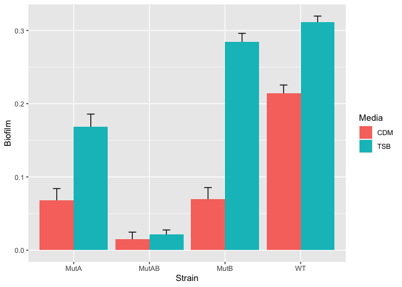<!-- -->

fun.data = “median_hilow” (When the default conf.int=0.95 is used, the
lower and upper quantiles computed are 0.025 and 0.975.) See also:
“mean_cl_boot” / “mean_sdl”

# Styling plots

``` r
ugly.plot <- ggplot(longdata, aes(x = Strain, y = Biofilm, fill = Media)) +
  stat_summary(fun.data = "median_hilow", geom = "errorbar", position=position_dodge(.9), width = 0.2) +
  stat_summary(fun = "mean", geom = "bar", position = position_dodge()) 
```

``` r
ugly.plot +
  theme_classic()
```

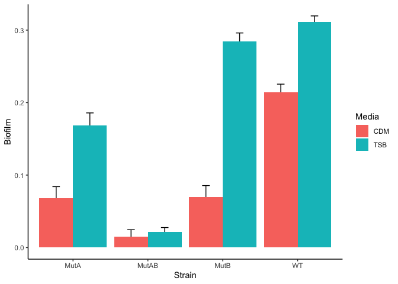<!-- -->

``` r
ugly.plot +
  theme_classic() +
  scale_fill_manual(values = c("gray80", "gray40")) 
```

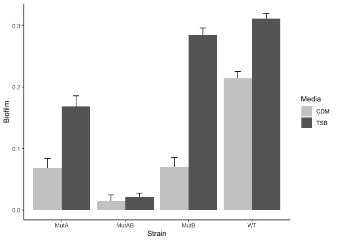<!-- -->

``` r
ugly.plot +
  theme_classic() +
  scale_fill_manual(values = c("gray80", "gray40")) +
  scale_y_continuous(expand = c(0, 0)) 
```

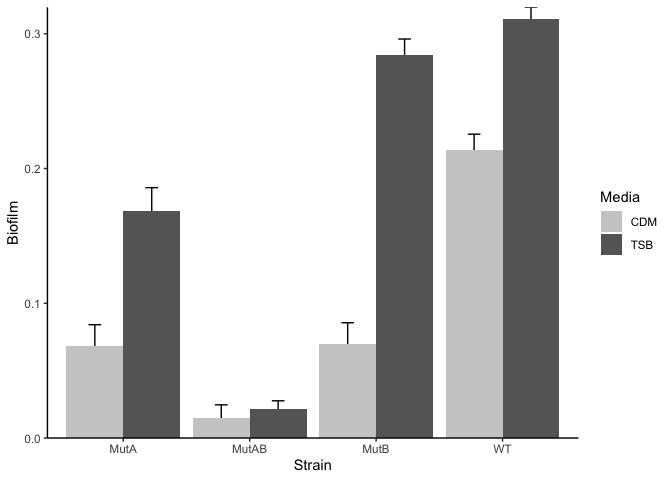<!-- -->

``` r
ugly.plot +
  theme_classic() +
  scale_fill_manual(values = c("gray80", "gray40")) +
  scale_y_continuous(expand = c(0, 0)) +
  ylab("Biofilm(OD600)") + xlab("")
```

<!-- -->

# Facets

``` r
ugly.plot +
  theme_classic() +
  scale_fill_manual(values = c("gray80", "gray40")) +
  scale_y_continuous(expand = c(0, 0)) +
  ylab("Biofilm(OD600)") + xlab("") +
  facet_wrap(~ Media)
```

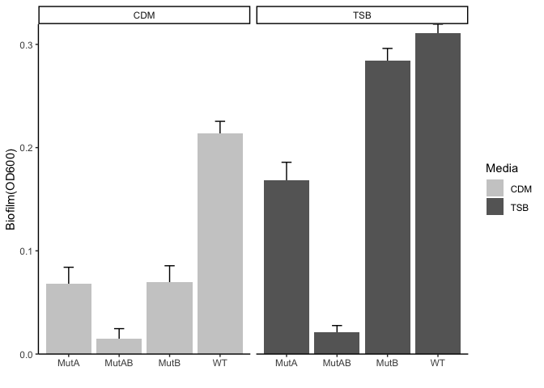<!-- -->

# Statistics

## One-way ANOVA

``` r
ANOVA <- aov(Biofilm ~ id, longdata)
```

    ##             Df Sum Sq Mean Sq F value Pr(>F)    
    ## id           7 0.3844 0.05492   440.9 <2e-16 ***
    ## Residuals   24 0.0030 0.00012                   
    ## ---
    ## Signif. codes:  0 '***' 0.001 '**' 0.01 '*' 0.05 '.' 0.1 ' ' 1

**RESULT:** There is a statistically significant difference between
these conditions, with a p-value of 9.2101939^{-24}

## Two-way ANOVA

``` r
ANOVA2 <- aov(Biofilm ~ Strain + Media, longdata)
```

    ##             Df  Sum Sq Mean Sq F value   Pr(>F)    
    ## Strain       3 0.25319 0.08440   49.07 4.62e-11 ***
    ## Media        1 0.08778 0.08778   51.03 1.11e-07 ***
    ## Residuals   27 0.04644 0.00172                     
    ## ---
    ## Signif. codes:  0 '***' 0.001 '**' 0.01 '*' 0.05 '.' 0.1 ' ' 1

**RESULT:** There is a statistically significant difference between
strains, with a p-value of 4.619916^{-11}. There is a statistically
significant difference between media, with a p-value of 1.1074002^{-7}.

## T-test Pairwise comparisons

**Pairwise comparisons with Bonferroni correction**

``` r
BONF <- pairwise.t.test(longdata$Biofilm,longdata$id, p.adj = "bonf")
BONF.table <- xtable(BONF$p.value, digits = 4)
print(BONF.table, type = "html")
```

<!-- html table generated in R 4.3.0 by xtable 1.8-4 package -->
<!-- Wed May 24 10:30:08 2023 -->
<table border="1">
<tr>
<th>
</th>
<th>
WT_TSB
</th>
<th>
MutA_TSB
</th>
<th>
MutB_TSB
</th>
<th>
MutAB_TSB
</th>
<th>
WT_CDM
</th>
<th>
MutA_CDM
</th>
<th>
MutB_CDM
</th>
</tr>
<tr>
<td align="right">
MutA_TSB
</td>
<td align="right">
0.0000
</td>
<td align="right">
</td>
<td align="right">
</td>
<td align="right">
</td>
<td align="right">
</td>
<td align="right">
</td>
<td align="right">
</td>
</tr>
<tr>
<td align="right">
MutB_TSB
</td>
<td align="right">
0.0732
</td>
<td align="right">
0.0000
</td>
<td align="right">
</td>
<td align="right">
</td>
<td align="right">
</td>
<td align="right">
</td>
<td align="right">
</td>
</tr>
<tr>
<td align="right">
MutAB_TSB
</td>
<td align="right">
0.0000
</td>
<td align="right">
0.0000
</td>
<td align="right">
0.0000
</td>
<td align="right">
</td>
<td align="right">
</td>
<td align="right">
</td>
<td align="right">
</td>
</tr>
<tr>
<td align="right">
WT_CDM
</td>
<td align="right">
0.0000
</td>
<td align="right">
0.0002
</td>
<td align="right">
0.0000
</td>
<td align="right">
0.0000
</td>
<td align="right">
</td>
<td align="right">
</td>
<td align="right">
</td>
</tr>
<tr>
<td align="right">
MutA_CDM
</td>
<td align="right">
0.0000
</td>
<td align="right">
0.0000
</td>
<td align="right">
0.0000
</td>
<td align="right">
0.0001
</td>
<td align="right">
0.0000
</td>
<td align="right">
</td>
<td align="right">
</td>
</tr>
<tr>
<td align="right">
MutB_CDM
</td>
<td align="right">
0.0000
</td>
<td align="right">
0.0000
</td>
<td align="right">
0.0000
</td>
<td align="right">
0.0001
</td>
<td align="right">
0.0000
</td>
<td align="right">
1.0000
</td>
<td align="right">
</td>
</tr>
<tr>
<td align="right">
MutAB_CDM
</td>
<td align="right">
0.0000
</td>
<td align="right">
0.0000
</td>
<td align="right">
0.0000
</td>
<td align="right">
1.0000
</td>
<td align="right">
0.0000
</td>
<td align="right">
0.0000
</td>
<td align="right">
0.0000
</td>
</tr>
</table>

**Pairwise comparisons with Tukey correction**

``` r
TUKEY <- TukeyHSD(ANOVA, "id")
TUKEY.table <- xtable(TUKEY$id, digits = 4)
print(TUKEY.table, type = "html")
```

<!-- html table generated in R 4.3.0 by xtable 1.8-4 package -->
<!-- Wed May 24 10:30:08 2023 -->
<table border="1">
<tr>
<th>
</th>
<th>
diff
</th>
<th>
lwr
</th>
<th>
upr
</th>
<th>
p adj
</th>
</tr>
<tr>
<td align="right">
MutA_TSB-WT_TSB
</td>
<td align="right">
-0.1422
</td>
<td align="right">
-0.1684
</td>
<td align="right">
-0.1161
</td>
<td align="right">
0.0000
</td>
</tr>
<tr>
<td align="right">
MutB_TSB-WT_TSB
</td>
<td align="right">
-0.0265
</td>
<td align="right">
-0.0526
</td>
<td align="right">
-0.0004
</td>
<td align="right">
0.0453
</td>
</tr>
<tr>
<td align="right">
MutAB_TSB-WT_TSB
</td>
<td align="right">
-0.2895
</td>
<td align="right">
-0.3156
</td>
<td align="right">
-0.2634
</td>
<td align="right">
0.0000
</td>
</tr>
<tr>
<td align="right">
WT_CDM-WT_TSB
</td>
<td align="right">
-0.0970
</td>
<td align="right">
-0.1231
</td>
<td align="right">
-0.0709
</td>
<td align="right">
0.0000
</td>
</tr>
<tr>
<td align="right">
MutA_CDM-WT_TSB
</td>
<td align="right">
-0.2430
</td>
<td align="right">
-0.2691
</td>
<td align="right">
-0.2169
</td>
<td align="right">
0.0000
</td>
</tr>
<tr>
<td align="right">
MutB_CDM-WT_TSB
</td>
<td align="right">
-0.2410
</td>
<td align="right">
-0.2671
</td>
<td align="right">
-0.2149
</td>
<td align="right">
0.0000
</td>
</tr>
<tr>
<td align="right">
MutAB_CDM-WT_TSB
</td>
<td align="right">
-0.2962
</td>
<td align="right">
-0.3224
</td>
<td align="right">
-0.2701
</td>
<td align="right">
0.0000
</td>
</tr>
<tr>
<td align="right">
MutB_TSB-MutA_TSB
</td>
<td align="right">
0.1157
</td>
<td align="right">
0.0896
</td>
<td align="right">
0.1419
</td>
<td align="right">
0.0000
</td>
</tr>
<tr>
<td align="right">
MutAB_TSB-MutA_TSB
</td>
<td align="right">
-0.1472
</td>
<td align="right">
-0.1734
</td>
<td align="right">
-0.1211
</td>
<td align="right">
0.0000
</td>
</tr>
<tr>
<td align="right">
WT_CDM-MutA_TSB
</td>
<td align="right">
0.0453
</td>
<td align="right">
0.0191
</td>
<td align="right">
0.0714
</td>
<td align="right">
0.0002
</td>
</tr>
<tr>
<td align="right">
MutA_CDM-MutA_TSB
</td>
<td align="right">
-0.1008
</td>
<td align="right">
-0.1269
</td>
<td align="right">
-0.0746
</td>
<td align="right">
0.0000
</td>
</tr>
<tr>
<td align="right">
MutB_CDM-MutA_TSB
</td>
<td align="right">
-0.0988
</td>
<td align="right">
-0.1249
</td>
<td align="right">
-0.0726
</td>
<td align="right">
0.0000
</td>
</tr>
<tr>
<td align="right">
MutAB_CDM-MutA_TSB
</td>
<td align="right">
-0.1540
</td>
<td align="right">
-0.1801
</td>
<td align="right">
-0.1279
</td>
<td align="right">
0.0000
</td>
</tr>
<tr>
<td align="right">
MutAB_TSB-MutB_TSB
</td>
<td align="right">
-0.2630
</td>
<td align="right">
-0.2891
</td>
<td align="right">
-0.2369
</td>
<td align="right">
0.0000
</td>
</tr>
<tr>
<td align="right">
WT_CDM-MutB_TSB
</td>
<td align="right">
-0.0705
</td>
<td align="right">
-0.0966
</td>
<td align="right">
-0.0444
</td>
<td align="right">
0.0000
</td>
</tr>
<tr>
<td align="right">
MutA_CDM-MutB_TSB
</td>
<td align="right">
-0.2165
</td>
<td align="right">
-0.2426
</td>
<td align="right">
-0.1904
</td>
<td align="right">
0.0000
</td>
</tr>
<tr>
<td align="right">
MutB_CDM-MutB_TSB
</td>
<td align="right">
-0.2145
</td>
<td align="right">
-0.2406
</td>
<td align="right">
-0.1884
</td>
<td align="right">
0.0000
</td>
</tr>
<tr>
<td align="right">
MutAB_CDM-MutB_TSB
</td>
<td align="right">
-0.2697
</td>
<td align="right">
-0.2959
</td>
<td align="right">
-0.2436
</td>
<td align="right">
0.0000
</td>
</tr>
<tr>
<td align="right">
WT_CDM-MutAB_TSB
</td>
<td align="right">
0.1925
</td>
<td align="right">
0.1664
</td>
<td align="right">
0.2186
</td>
<td align="right">
0.0000
</td>
</tr>
<tr>
<td align="right">
MutA_CDM-MutAB_TSB
</td>
<td align="right">
0.0465
</td>
<td align="right">
0.0204
</td>
<td align="right">
0.0726
</td>
<td align="right">
0.0001
</td>
</tr>
<tr>
<td align="right">
MutB_CDM-MutAB_TSB
</td>
<td align="right">
0.0485
</td>
<td align="right">
0.0224
</td>
<td align="right">
0.0746
</td>
<td align="right">
0.0001
</td>
</tr>
<tr>
<td align="right">
MutAB_CDM-MutAB_TSB
</td>
<td align="right">
-0.0068
</td>
<td align="right">
-0.0329
</td>
<td align="right">
0.0194
</td>
<td align="right">
0.9874
</td>
</tr>
<tr>
<td align="right">
MutA_CDM-WT_CDM
</td>
<td align="right">
-0.1460
</td>
<td align="right">
-0.1721
</td>
<td align="right">
-0.1199
</td>
<td align="right">
0.0000
</td>
</tr>
<tr>
<td align="right">
MutB_CDM-WT_CDM
</td>
<td align="right">
-0.1440
</td>
<td align="right">
-0.1701
</td>
<td align="right">
-0.1179
</td>
<td align="right">
0.0000
</td>
</tr>
<tr>
<td align="right">
MutAB_CDM-WT_CDM
</td>
<td align="right">
-0.1992
</td>
<td align="right">
-0.2254
</td>
<td align="right">
-0.1731
</td>
<td align="right">
0.0000
</td>
</tr>
<tr>
<td align="right">
MutB_CDM-MutA_CDM
</td>
<td align="right">
0.0020
</td>
<td align="right">
-0.0241
</td>
<td align="right">
0.0281
</td>
<td align="right">
1.0000
</td>
</tr>
<tr>
<td align="right">
MutAB_CDM-MutA_CDM
</td>
<td align="right">
-0.0532
</td>
<td align="right">
-0.0794
</td>
<td align="right">
-0.0271
</td>
<td align="right">
0.0000
</td>
</tr>
<tr>
<td align="right">
MutAB_CDM-MutB_CDM
</td>
<td align="right">
-0.0552
</td>
<td align="right">
-0.0814
</td>
<td align="right">
-0.0291
</td>
<td align="right">
0.0000
</td>
</tr>
</table>
